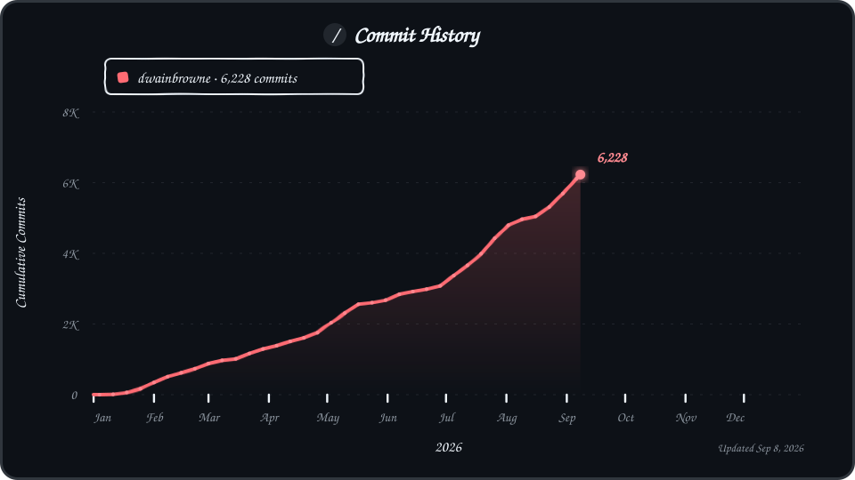

# Hi, I'm Dwain

Toronto-based founder and software architect building practical software companies around operations, sales, AI workflows, personal finance, and founder execution.

Founder of [SnapSuite](https://www.snapsuite.io), [LeadScore AI](https://getleadscore.ai), [Affordly](https://affordly.app), and [Vibe Code to Profit](https://dwain.me/skool).

## Start Here

- [YouTube](https://www.youtube.com/@dwainbrowne) - software builds, AI workflows, Cloudflare-first SaaS, coding, and entrepreneurship
- [LinkedIn](https://www.linkedin.com/in/dwainbrowne/) - company updates, founder lessons, software strategy, and business context
- [dwain.me](https://dwain.me) - my personal site, companies, writing, speaking, and consulting
- [Book a consultation](https://dwain.me/consultation.html) - map a product, workflow, AI system, or sales process
- [Join Vibe Code to Profit](https://dwain.me/skool) - free community for building, launching, and monetizing software with AI

## Companies

### SnapSuite

[SnapSuite](https://www.snapsuite.io) helps contractors and skilled trades teams manage the work between first call and final payment.

- Built for HVAC, plumbing, electrical, garage door, and skilled trades companies
- Supports projects, work orders, purchase orders, voice, payments, dispatch visibility, and job follow-up
- Focused on helping contractors stay organized, reduce missed follow-up, and get paid faster

### LeadScore AI

[LeadScore AI](https://getleadscore.ai) helps salespeople, founders, agencies, and small sales teams run better outbound without doing all the research by hand.

- AI-assisted lead research, prioritization, and personalized cold outreach
- Built around the idea that sales teams need better prioritization, not just more activity
- Focused on helping teams spend more time on the leads that actually matter

### Affordly

[Affordly](https://affordly.app) is a mobile-first personal finance app for tracking expenses, seeing the full-year picture, and building better money habits.

- Expense tracking without turning budgeting into a heavy finance project
- Personal P&L visibility so people can see where money is going
- Built around simple habits people can actually keep using

### Vibe Code to Profit

[Vibe Code to Profit](https://dwain.me/skool) is a free community for people and organizations building real software with AI.

- Live builds, Cloudflare-first SaaS patterns, AI workflows, and founder execution
- Focused on moving from prompt to product, then from useful product to business outcome
- Built for builders who want practical shipping, launch, and monetization discipline

## GitHub Activity

## Public Tools and Useful Repos

These are the repos that best reflect what I want to make public: usable starter kits, practical utilities, and supporting tools.

### Starter Kits

- [mobile-app-starter-template](https://github.com/dwainbrowne/mobile-app-starter-template) - starter template for mobile app builds
- [dwain](https://github.com/dwainbrowne/dwain) - source for my personal website and company profile hub

### Automation and Productivity

- [organize-files](https://github.com/dwainbrowne/organize-files) - utility scripts to organize messy document folders
- [onedrive-to-git](https://github.com/dwainbrowne/onedrive-to-git) - sync a OneDrive folder to GitHub
- [c.o.r.e](https://github.com/dwainbrowne/c.o.r.e) - structured folder generator for organizing company and personal resources
- [ai-time-tracking](https://github.com/dwainbrowne/ai-time-tracking) - automation for logging time
- [utility-teleprompter](https://github.com/dwainbrowne/utility-teleprompter) - teleprompter utility for recording videos

### Data and Integration Utilities

- [clean-excel-data](https://github.com/dwainbrowne/clean-excel-data) - clean Excel data and upload it to Google Sheets
- [youtube-get-playlist-videos](https://github.com/dwainbrowne/youtube-get-playlist-videos) - fetch video lists from YouTube playlists
- [dialpad-webhook-decoder](https://github.com/dwainbrowne/dialpad-webhook-decoder) - webhook decoding utility
- [auth0](https://github.com/dwainbrowne/auth0) - front-end authentication pattern using Auth0 and Azure API Management

### AI, Notes, and Writing

- [chatgpt-prompts](https://github.com/dwainbrowne/chatgpt-prompts) - prompt collection for getting more from AI tools
- [docs](https://github.com/dwainbrowne/docs) - notes and documentation

## Content

- [YouTube](https://www.youtube.com/@dwainbrowne) - live builds, AI workflows, Cloudflare, development, and founder lessons
- [Live and video hub](https://dwain.me/live.html) - featured technical and founder videos
- [Blog and notes](https://dwain.me/blog.html) - writing from the builder side
- [Speaking](https://dwain.me/speaking.html) - keynotes and workshops on AI, software, sales systems, and building faster

## What I'm Building Toward

- Better operations software for contractors and skilled trades teams
- Better sales systems for teams that need research, prioritization, and outreach support
- Better personal finance clarity through simple mobile-first product design
- Better AI-assisted software building through Vibe Code to Profit
- Better public teaching around Cloudflare-first SaaS, practical AI, and founder execution

Last refreshed: 2026-06-03.
